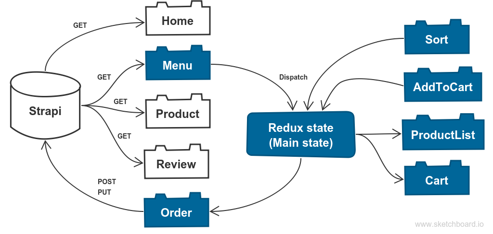

# CMS - Flower shop ([Demo](http://18.221.231.1:8000/))
This web application is only using for my study about Headless CMS. You may want to know how to start [here](./HOWTO.md).

## Online demo and screenshot
* [Online demo on Amazon Web Services](http://18.221.231.1:8000/)

## Table of contents
* [Main information](#main-information)
* Requirement
    * [Docker installation](https://www.docker.com/get-started)
    * [MongoDB](https://hub.docker.com/_/mongo/)
    * [Strapi](https://hub.docker.com/r/strapi/strapi/)
* Structure
    * [Application structure](#application-structure)
    * [Database structure](#database-structure)
* [Deployment](#deployment)
    * [The simple Express server in Dockerfile on GitHub](https://github.com/nguyenkhois/expressjs-docker-simple-server)
    * [My deployment on Docker Hub](https://hub.docker.com/r/khois/expresssrv/)
* Find me on
    * [GitHub](https://github.com/nguyenkhois)
    * [npm](https://www.npmjs.com/~nguyenkhois)
    * [Visual Studio Marketplace](https://marketplace.visualstudio.com/items?itemName=KhoiLe.extra-react-snippets)
    * [Docker Hub](https://hub.docker.com/u/khois/)

## Main information
This project is using of many dependencies and other things like Strapi, Amazon Web Services - EC2.

|Main information|Notes|
|---|:---:|
|Pure JavaScript|ES6 and ES7|
|Bootstrap|Using for grid layout|
|React|v16.5|
|Redux|v4|
|React-Redux|v5|
|React-Router|v4|
|Strapi|v3.0.0 alpha 14.1.1|
|Docker|Linux container|
|Amazon Web Services (AWS)|EC2-Linux|

## Structure
### Application structure

### Database structure

| Content type | Field | Data type | Key | Note |
|---|---|---|---|--|
|**category**|__id_| String|Primary key | Auto generated by Strapi (**1**)|
||name|String| |Category name|
|**product**|__id_|String| Primary key |Auto generated by Strapi (**2**)|
||name|String| |Product name|
||description|Text| ||
||price|Decimal| ||
||inStock|Integer| ||
||_categoryId_|String|Foreign key |Get from (**1**)|
||image|Media|| |
|**order**|_id|String|Primary key |Auto generated by Strapi|
||customerInfo|JSON| |Customer information|
||orderedProducts|JSON| ||
||sum|Decimal| ||
||isDelivered|Boolean| ||
|**review**|_id|String|Primary key |Auto generated by Strapi|
||_productId_|String|Foreign key |Get from (**2**)|
||content|Text| |Reviewer comment|
||rating|Integer| ||
||name|String| |Reviewer name|
||email|Email| |Reviewer email|

## Deployment

## References
* [Strapi tutorials](https://strapi.io/documentation/tutorials/)
* [Express server config for React-Router](https://github.com/reactjs/react-router-tutorial/blob/master/lessons/11-productionish-server/README.md)